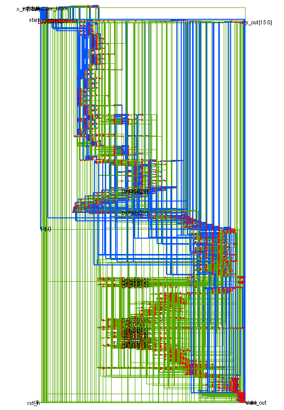
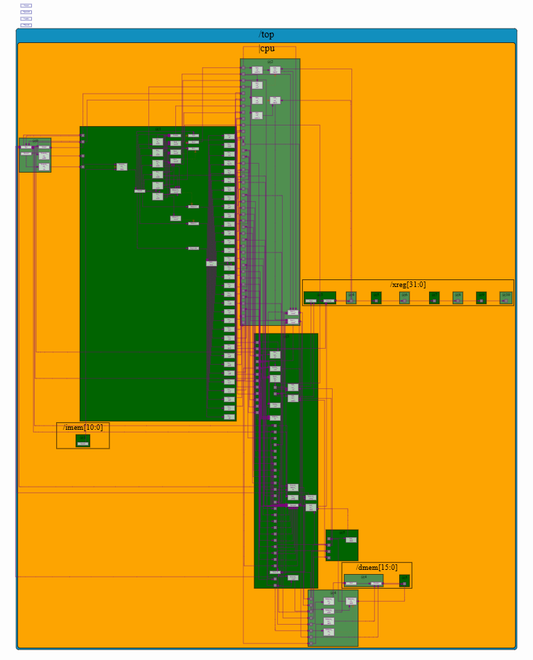
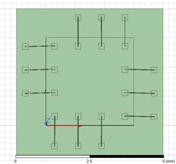
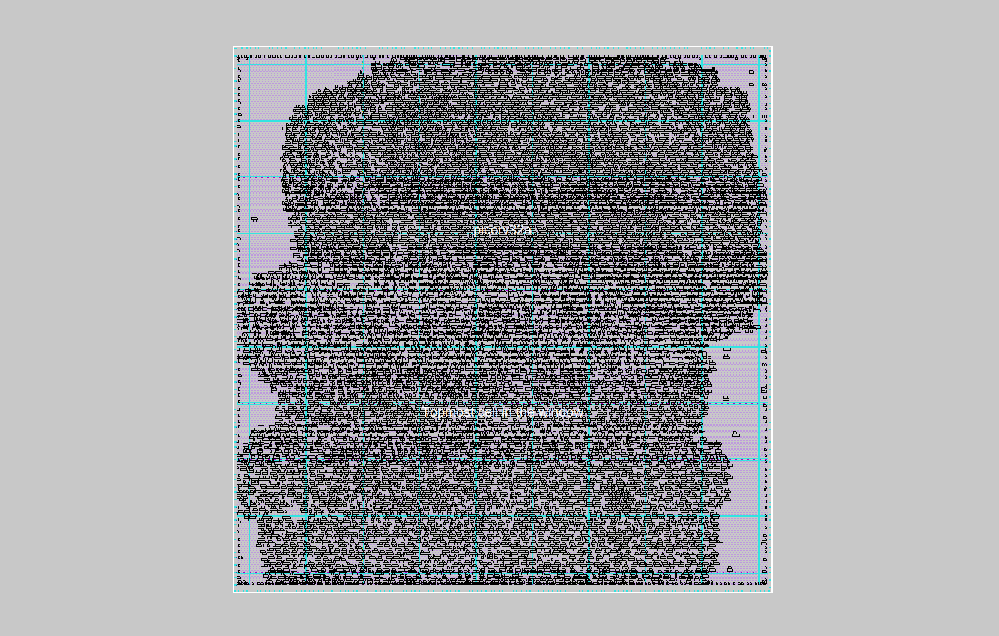

  
  
  
  
   
  <i>MAC Unit Netlist (Patent) &nbsp;·&nbsp; RISC-V Core (Makerchip) &nbsp;·&nbsp; Semiconductor Packaging (ANSYS) &nbsp;·&nbsp; GDSII Layout (Magic VLSI)</i>
    
  <h1>Preetham SK</h1>
  
Aspiring VLSI Engineer &nbsp;·&nbsp; B.Tech EEE @ VIT Chennai &nbsp;·&nbsp; MS Applicant — Germany 🇩🇪

  &nbsp;
  &nbsp;
  

I am a final-year B.Tech EEE student at VIT Chennai, working towards a career in VLSI and planning to pursue a Master's degree in Germany. Over the past two years I have completed 6 projects spanning RTL design, physical design, EDA automation, and semiconductor packaging — along with 6 publications including 2 patents, 2 SCI journal papers, and a book chapter with CRC Press. I have also done internships at CNVD VIT, CSGT VIT, Maven Silicon, and SkillDzire.

## Publications & Patents

| Type | Details |
|------|---------|
| 🏛️ Patent [Published] | Dynamic Reconfigurable Binary Multiplier — App. No. 202541080342, Published Sep 2025 |
| 🏛️ Patent [Under Review] | Low Power VLSI Design — Preetham SK (First Inventor) |
| 📰 SCI Journal [Under Review] | 16-Bit MAC Unit — Preetham SK (First Author) |
| 📰 SCI Journal [Under Review] | Low Power VLSI Design — Preetham SK (Second Author) |
| 📖 Book Chapter [Accepted] | FPGA Based Solar Powered EV Charging Station — CRC Press, Taylor & Francis (ISBN: 9781041093626) |
| 📰 Research Article [Under Review] | CNN Application — Preetham SK (First Author) |

## Projects

| # | Project | Tools |
|---|---------|-------|
| [01](https://github.com/PreethamSK163/Project-1-Digital-VLSI-SoC-Design-and-Planning) | **Digital VLSI SoC Design & Planning** — RTL-to-GDSII on PicoRV32a; custom cell integration; ECO timing closure; DRC/LVS clean | Verilog, OpenLANE, Sky130 PDK, Magic VLSI |
| [02](https://github.com/PreethamSK163/Project-2-RISC-V-CPU-Design-using-TL-Verilog) | **RISC-V CPU Design using TL-Verilog** — 5-stage pipelined RV32I core; hazard bypassing; verified on Makerchip | TL-Verilog, Makerchip |
| [03](https://github.com/PreethamSK163/Project-3-VLSI-Design-Automation-Using-TCL-VSDSYNTH) | **VLSI Design Automation Using TCL — VSDSYNTH** — Automated RTL-to-QoR framework; 6845 gates on openMSP430 | TCL, Yosys, OpenTimer, Linux |
| [04](https://github.com/PreethamSK163/Project-4-SPI-Physical-Design-using-Qflow) | **SPI Physical Design using Qflow** — 3106 cells, 22417 routes; DRC/LVS clean; GDSII generated | Qflow, Yosys, Magic, Netgen |
| [05](https://github.com/PreethamSK163/Project-5-RTL-Digital-Design-Modules-using-Verilog) | **RTL Digital Design Modules using Verilog** — UART, FIFO, Traffic Light, ATC, Washing Machine | Verilog HDL, ModelSim |
| [06](https://github.com/PreethamSK163/Project-6-Packaging-Design-and-Simulation-using-ANSYS) | **Packaging Design and Simulation using ANSYS** — Thermal & thermo-mechanical analysis; flip-chip BGA, QFN | ANSYS Electronics Desktop |

## Certifications

| Certification | Details |
|---------------|---------|
| 🏅 [CeNSE Winter School on Semiconductor Technology](https://yourportfolio.com) | Certificate of Distinction — IISc Bengaluru, Dec 2025 |
| 🎓 [Chip-based VLSI Design for Industrial Applications](https://coursera.org/verify/specialization/52G1UVOM8JOS) | Specialisation — L&T EduTech via Coursera, Sep 2025 |
| 📋 [RISC-V Processor — RV32I Base ISA](https://yourportfolio.com) | Maven Silicon, Feb 2025 |

## Skills

| Category | Tools |
|----------|-------|
| **Languages** | Verilog HDL, TL-Verilog, TCL, C, Python |
| **EDA Tools** | OpenLANE, Yosys, Magic VLSI, Qflow, Cadence NC Launch, Cadence Genus, ModelSim, Netgen, OpenTimer, HSPICE, LT Spice |
| **Simulation** | ANSYS Electronics Desktop, ANSYS Mechanical, Makerchip IDE |
| **Platforms** | Linux, Windows |
